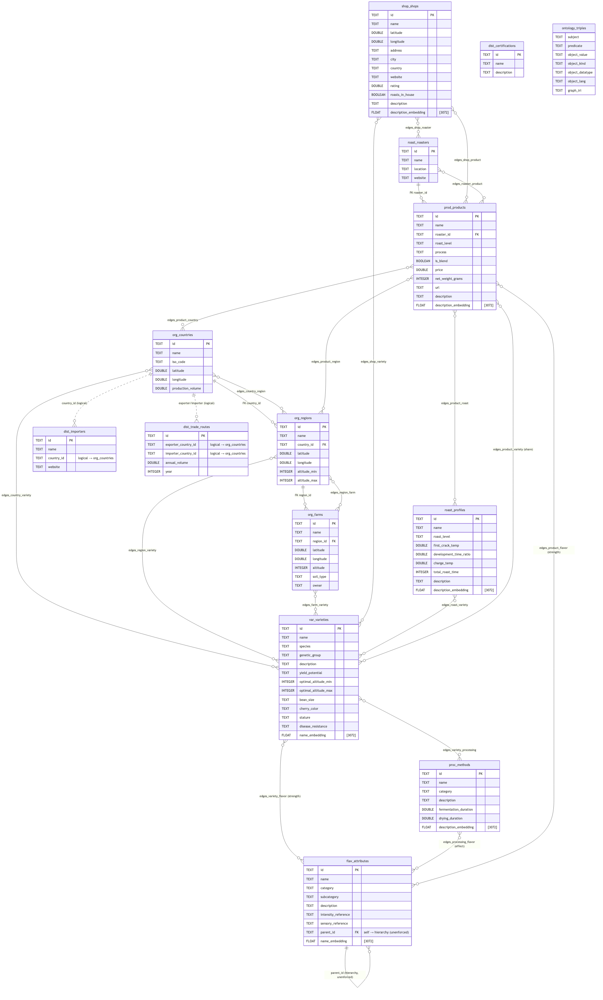
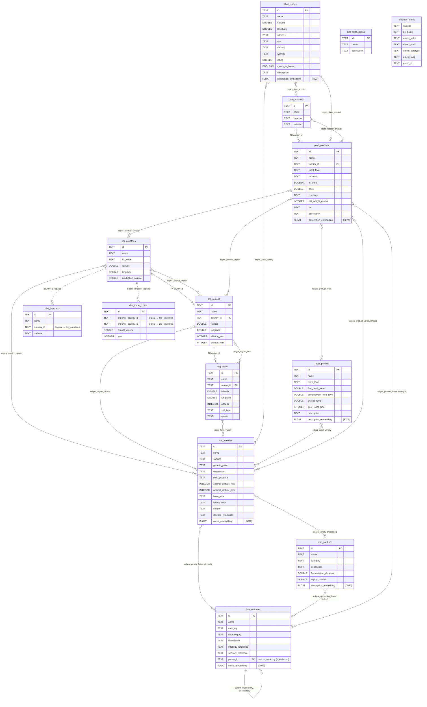

# Coffee Atlas — Database ERD

> Source of truth: [`backend/db/schema.py`](../backend/db/schema.py) (raw DuckDB DDL, no ORM).
> 33 tables total: **14 entity tables**, **18 graph edge tables**, and **1 ontology triple store**.
>
> Conventions (apply to every table unless noted):
> - `id TEXT PRIMARY KEY` holds a UUID string.
> - Every table carries `created_at` / `updated_at TIMESTAMP DEFAULT current_timestamp` (omitted below to reduce noise).
> - `*_embedding` columns are `FLOAT[3072]` Gemini `gemini-embedding-001` vectors.
> - Tables are prefixed by domain: `var_`, `org_`, `proc_`, `roast_`, `flav_`, `dist_`, `shop_`, `prod_`, `edges_`.

GitHub renders the Mermaid block below as a diagram automatically. Pre-rendered
images are also committed alongside this file:
[`database-erd.svg`](./database-erd.svg) (vector) and
[`database-erd.png`](./database-erd.png) (raster).

## Conceptual ERD (entities + relationships)

The 18 `edges_*` tables are the join layer of the knowledge graph. To keep the
map readable they are drawn here as **labeled many-to-many lines** rather than as
boxes; each one is a real table whose columns are listed in the appendix.

- **Solid line** (`||--o{`) = enforced foreign key (`REFERENCES` in the DDL).
- **Dotted line** (`||..o{`) = logical FK stored as a plain `TEXT` column (not enforced).
- **`}o--o{`** = many-to-many realized by an `edges_*` table (label = table name).

## Entity summary

Coffee Atlas models the coffee supply chain as a knowledge graph. Entity tables
are the **nodes**; `edges_*` tables are the **edges**. Because the DuckPGQ
extension is unavailable on the current build, traversal endpoints BFS over these
edge tables directly instead of using a property graph.

| Domain | Table | Represents |
|--------|-------|------------|
| Varieties | `var_varieties` | Coffee varieties (genetics, agronomy, flavor seed). 55 Arabica + 47 Robusta from WCR. |
| Origins | `org_countries` | Producing countries (geo + production volume). |
| Origins | `org_regions` | Growing regions within a country (FK → country). |
| Origins | `org_farms` | Individual farms/estates within a region (FK → region). |
| Processing | `proc_methods` | Processing methods (washed, natural, honey, anaerobic…). |
| Roasting | `roast_profiles` | Roast profiles (temp curves, development ratio, level). |
| Roasting | `roast_roasters` | Roasting companies. Parent of `prod_products` (FK). |
| Flavor | `flav_attributes` | WCR Sensory Lexicon attributes; self-referencing `parent_id` builds the 3-tier flavor-wheel hierarchy. |
| Distribution | `dist_importers` | Green-coffee importers (logical FK → country). |
| Distribution | `dist_trade_routes` | Export→import trade flows with annual volume. |
| Distribution | `dist_certifications` | Certifications (FairTrade, Organic…). Standalone reference table. |
| Shops | `shop_shops` | Specialty coffee shops (geo, rating, roasts-in-house). |
| Products | `prod_products` | Scraped roaster products/SKUs (FK → roaster). |
| Ontology | `ontology_triples` | RDF subject/predicate/object triples exported from the OWL ontology. No `id`/FKs; not connected to the relational graph. |

### Enforced vs. logical foreign keys

Only four relationships are enforced with `REFERENCES` on the entity tables:

- `org_regions.country_id → org_countries.id`
- `org_farms.region_id → org_regions.id`
- `prod_products.roaster_id → roast_roasters.id`
- (every `edges_*` table also declares `REFERENCES` on both of its endpoint columns)

These are stored as plain `TEXT` and **not** enforced:

- `flav_attributes.parent_id` (self-reference, builds the flavor hierarchy)
- `dist_importers.country_id`
- `dist_trade_routes.exporter_country_id`, `dist_trade_routes.importer_country_id`

## Edge tables (physical join layer)

Every edge table has `id TEXT PK`, the two endpoint FK columns (both
`REFERENCES` their entity table), `created_at`/`updated_at`, and — for some — a
payload column.

| Edge table | Source → Destination | Payload |
|------------|----------------------|---------|
| `edges_variety_flavor` | `var_varieties` → `flav_attributes` | `strength DOUBLE` |
| `edges_country_variety` | `org_countries` → `var_varieties` | — |
| `edges_region_variety` | `org_regions` → `var_varieties` | — |
| `edges_farm_variety` | `org_farms` → `var_varieties` | — |
| `edges_shop_variety` | `shop_shops` → `var_varieties` | — |
| `edges_variety_processing` | `var_varieties` → `proc_methods` | — |
| `edges_roast_variety` | `roast_profiles` → `var_varieties` | — |
| `edges_processing_flavor` | `proc_methods` → `flav_attributes` | `effect TEXT` |
| `edges_country_region` | `org_countries` → `org_regions` | — |
| `edges_region_farm` | `org_regions` → `org_farms` | — |
| `edges_product_variety` | `prod_products` → `var_varieties` | `share DOUBLE` |
| `edges_product_region` | `prod_products` → `org_regions` | — |
| `edges_product_country` | `prod_products` → `org_countries` | — |
| `edges_product_flavor` | `prod_products` → `flav_attributes` | `strength DOUBLE` |
| `edges_product_roast` | `prod_products` → `roast_profiles` | — |
| `edges_shop_product` | `shop_shops` → `prod_products` | — |
| `edges_roaster_product` | `roast_roasters` → `prod_products` | — |
| `edges_shop_roaster` | `shop_shops` → `roast_roasters` | — |

> Note: `edges_country_region` and `edges_region_farm` duplicate the enforced
> `org_*` FK hierarchy as explicit graph edges so traversal queries can walk
> origin geography the same way they walk every other relationship.
